# Fabric shell

Десктоп-шелл для i3/X11 на [Fabric](https://github.com/Fabric-Development/fabric): стеклянный macOS-подобный бар,
лаунчер вместо rofi, календарь, заметки Dayline, музыка, звук, сеть, системный монитор, лимиты Claude,
уведомления, голосовой ввод и экран блокировки.

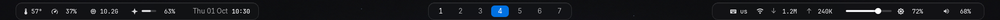

Все новые снимки в этом README сделаны в отдельном worktree с `FABRIC_MOCK=1`. Mock-режим подставляет
стабильные значения для CPU/RAM/GPU, сети, звука, музыки, Claude, рабочих пространств, календаря,
уведомлений и голосового OSD.

## Лаунчер

`Super+D`. Пока поле пустое, видна только строка поиска; результаты выезжают по мере ввода.

| Пустой | Приложения | Калькулятор |
|---|---|---|
| 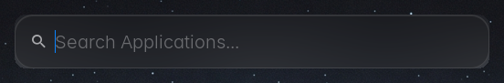 | 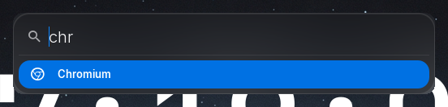 | 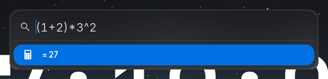 |

| Сайты | SSH-хосты | Эмодзи |
|---|---|---|
| 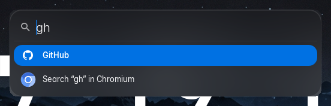 | 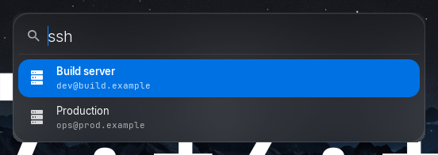 | 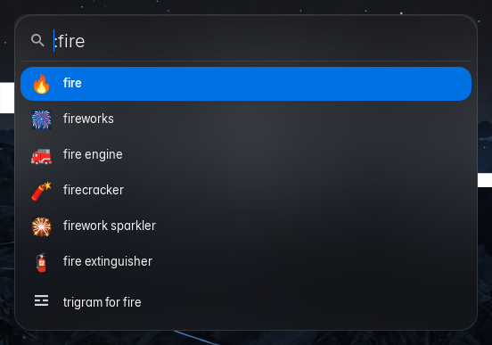 |

| Ввод | Результат |
|---|---|
| `chr`, `cs2`, `lw`, `chrmium` | приложения: префикс, подстрока, затем нечёткий поиск; чаще запускаемые выше |
| `gh`, `sj24` | сайты из [`sites.toml`](sites.toml), открываются в браузере |
| `ssh` | SSH-хосты из `sites.toml`, открываются в терминале |
| `youtube.com`, `https://…` | открыть ссылку |
| `(1+2)*3^2`, `sqrt(2)` | калькулятор, `Enter` копирует результат |
| `lock`, `suspend`, `reboot`, `shutdown`, `logout` | питание; опасные действия просят второй `Enter` |
| `> htop` | команда в терминале (`st`) или в фоне |
| `c:` `c: текст` | история CopyQ |
| `:fire` | эмодзи, `Enter` копирует |
| что угодно без совпадений | поиск в Chromium |

`↑`/`↓`, `Tab`/`Shift+Tab` — выбор, `Enter` или клик — запуск, `Esc` или клик мимо — закрыть.

### Сайты и SSH

```toml
[GitHub]
url = "https://github.com"

["Build server"]
ssh = "dev@build.example"
```

Файл перечитывается при каждом открытии лаунчера, перезапуск не нужен.

## Панели и окна

Клик по часам открывает календарь, по статистике слева — системный монитор, по сети — Wi-Fi/Ethernet,
по громкости — устройства вывода и ввода. Наведение на яркость показывает слайдер; колесо меняет её на 5%.

| Календарь | Системный монитор | Claude: 5-часовое и недельное окно |
|---|---|---|
| 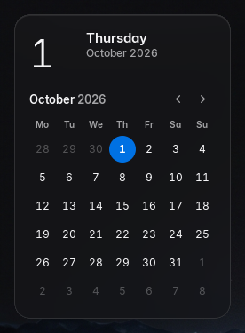 | 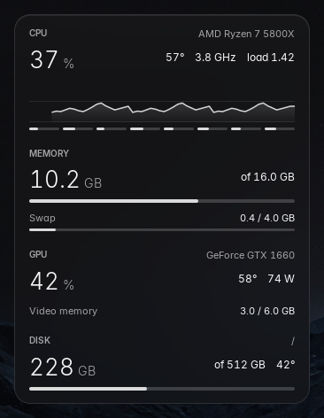 | 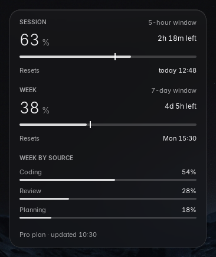 |

| Dayline (`Super+C`) | Звук | Сеть |
|---|---|---|
| 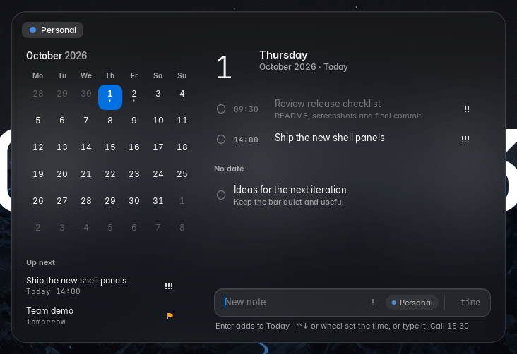 | 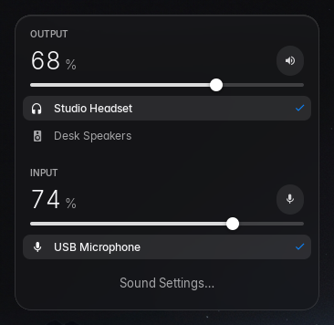 | 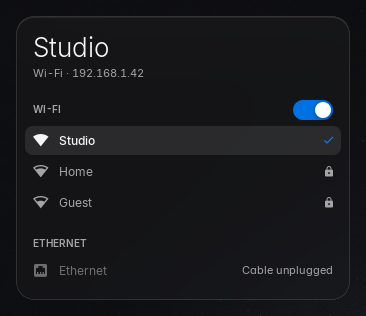 |

Dayline хранит заметки локально, поддерживает время, приоритеты, повторения и двустороннюю синхронизацию
с iCloud Reminders. Без iCloud заметки работают локально.

| Музыка (`Super+M`) | Уведомления и центр (`Super+N`) | Голосовой ввод (`Super+V`) |
|---|---|---|
| 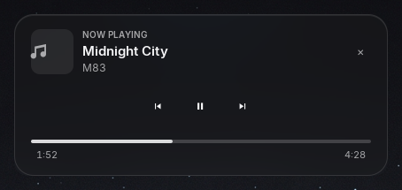 | 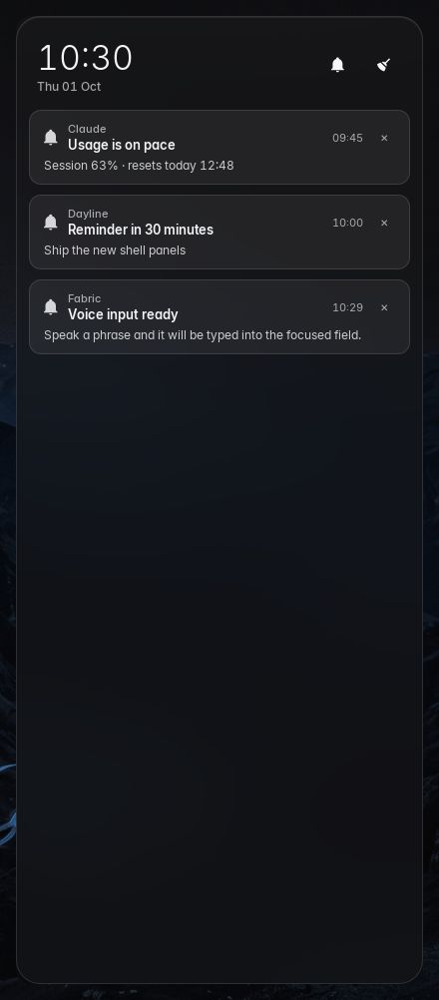 | 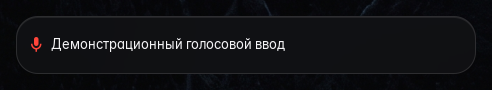 |

| Popup-уведомления | Пароль polkit/keyring | Экран блокировки |
|---|---|---|
| 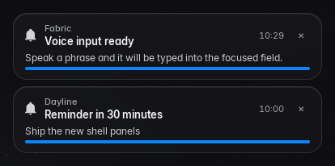 | 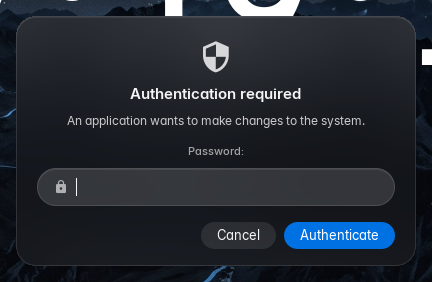 | 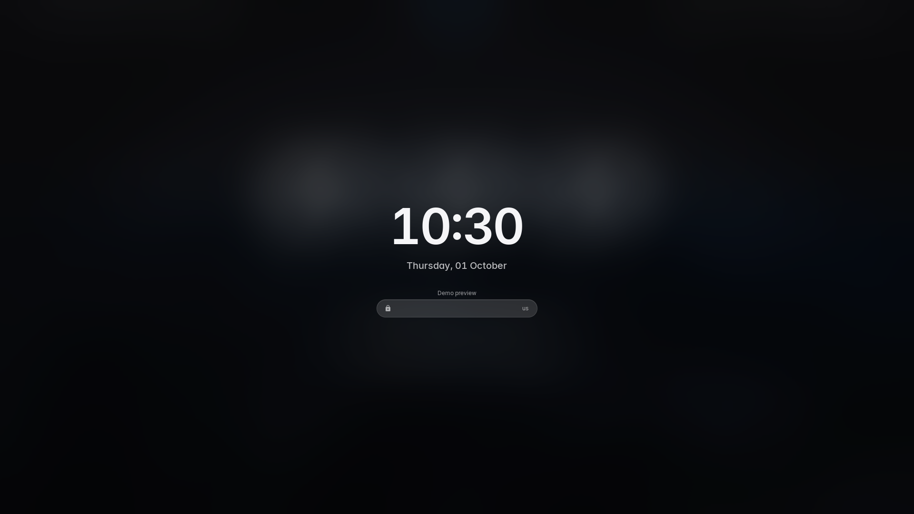 |

| OSD громкости | OSD раскладки |
|---|---|
| 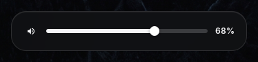 | 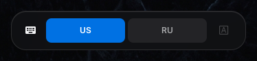 |

Голосовой OSD не забирает фокус: распознанные фразы печатаются в активное поле. Модель `faster-whisper`
запускается отдельным `uv`-скриптом и использует CUDA при наличии, иначе CPU.

Экран блокировки: `Super+Escape` / `Super+L`, пароль проверяется через PAM.

Окно пароля (`modules/auth.py`) заменяет два системных диалога:

- **polkit** — когда `pkexec`, `systemctl`, GParted и другие операции просят права;
- **gnome-keyring** — разблокировка и создание связки ключей при запуске приложений.

## Установка

Системные пакеты: `python` 3.14, `gtk3`, `python-gobject`, `picom`, `pipewire` (`wpctl`, `pactl`), `lm_sensors`,
`jq`, `copyq`, `st`, `chromium`, `xdotool`, шрифты JetBrainsMono Nerd Font и Noto Color Emoji.

```sh
python -m venv ~/.config/fabric/.venv
~/.config/fabric/.venv/bin/pip install -r ~/.config/fabric/requirements.txt
~/.config/fabric/.venv/bin/python ~/.config/fabric/config.py --check
~/.config/fabric/launch.sh
```

i3:

```
exec --no-startup-id $HOME/.config/fabric/launch.sh
bindsym $mod+d      exec --no-startup-id $HOME/.config/fabric/toggle-launcher.sh
bindsym $mod+m      exec --no-startup-id $HOME/.config/fabric/toggle-music.sh
bindsym $mod+n      exec --no-startup-id $HOME/.config/fabric/toggle-notifications.sh
bindsym $mod+c      exec --no-startup-id $HOME/.config/fabric/toggle-dayline.sh
bindsym $mod+v      exec --no-startup-id $HOME/.config/fabric/toggle-voice.sh
bindsym $mod+Escape exec --no-startup-id $HOME/.config/fabric/lock.sh
```

### Mock-режим для снимков

В отдельном worktree или на стенде без реальных источников данных:

```sh
FABRIC_MOCK=1 ./launch.sh
```

Режим не запускает системные скрипты, не обращается к сети и не использует микрофон; данные находятся в
`services/mock.py`.

Проверка изоляции:

```sh
FABRIC_MOCK=1 ~/.config/fabric/.venv/bin/python test_mock.py
```

Блюр и анимации picom настраиваются только для окон с классом `Config.py`. Готовый конфиг лежит в
[`picom.conf`](picom.conf) (picom v12+, backend `glx`):

```sh
ln -sf ~/.config/fabric/picom.conf ~/.config/picom/picom.conf
pkill picom; picom -b
```

## Устройство

`config.py` собирает модули из `modules/` (окна), которые берут данные из `services/` и строятся на
`shared/` (базовые окна, виджеты). Стили — `style.css` и токены `design.toml` / `styles/tokens.css`.
Подробно — в [ARCHITECTURE.md](ARCHITECTURE.md).
