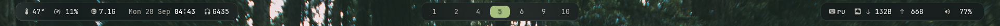
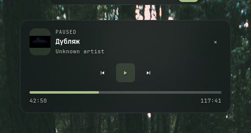
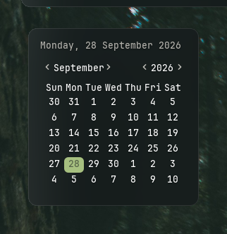
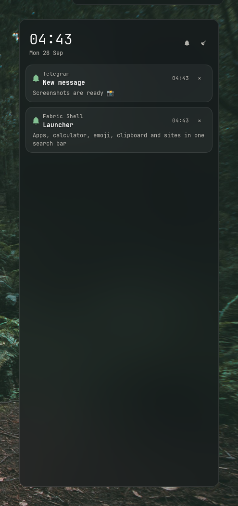

# Fabric shell

Десктоп-шелл для i3/X11 на [Fabric](https://github.com/Fabric-Development/fabric): бар, лаунчер вместо rofi,
уведомления, музыка, OSD громкости, календарь и экран блокировки. Палитра Everforest, стеклянные
поверхности с блюром picom поверх обоев.



## Лаунчер

`Super+D`. Пока поле пустое, видна только строка поиска; результаты выезжают по мере ввода.

| Пустой | Приложения | Калькулятор |
|---|---|---|
|  |  |  |

| Сайты | Эмодзи |
|---|---|
|  |  |

| Ввод | Результат |
|---|---|
| `chr`, `cs2`, `lw`, `chrmium` | приложения: префикс, подстрока, затем нечёткий поиск (первые буквы слов, пропущенные буквы); чаще запускаемые выше |
| `gh`, `sj24` | сайты из [`sites.toml`](sites.toml), открываются в браузере |
| `youtube.com`, `https://…` | открыть ссылку |
| `(1+2)*3^2`, `sqrt(2)` | калькулятор, `Enter` копирует результат |
| `lock`, `suspend`, `reboot`, `shutdown`, `logout` | питание; reboot/shutdown/logout просят второй `Enter` |
| `> htop` | команда в терминале (`st`) или в фоне |
| `c:` `c: текст` | история CopyQ, `Enter` делает запись текущим буфером |
| `:fire` | эмодзи, `Enter` копирует |
| что угодно без совпадений | поиск в Chromium |

`↑`/`↓`, `Tab`/`Shift+Tab` — выбор, `Enter` или клик — запуск, `Esc` или клик мимо — закрыть.

### Сайты

```toml
[GitHub]
url = "https://github.com"
icon = "\U000F02A4"        # глиф Nerd Font, необязательно

["Docker Hub"]              # имя с пробелом — в кавычках
url = "https://hub.docker.com"
```

Файл перечитывается при каждом открытии лаунчера, перезапуск не нужен.

## Остальные окна

| Музыка (`Super+M`) | Календарь (клик по часам) | Громкость |
|---|---|---|
|  |  |  |

| Уведомления | Центр уведомлений (`Super+N`) |
|---|---|
|  |  |

Экран блокировки: `Super+Escape` / `Super+L`, пароль проверяется через PAM.

## Установка

Системные пакеты: `python` 3.14, `gtk3`, `python-gobject`, `picom`, `pipewire` (`wpctl`, `pactl`), `lm_sensors`,
`jq`, `copyq`, `st`, `chromium`, шрифты JetBrainsMono Nerd Font и Noto Color Emoji.

```sh
python -m venv ~/.config/fabric/.venv
~/.config/fabric/.venv/bin/pip install -r ~/.config/fabric/requirements.txt
~/.config/fabric/.venv/bin/python ~/.config/fabric/config.py --check   # самопроверка
~/.config/fabric/launch.sh                                             # запуск (заменяет polybar)
```

i3:

```
exec --no-startup-id $HOME/.config/fabric/launch.sh
bindsym $mod+d      exec --no-startup-id $HOME/.config/fabric/toggle-launcher.sh
bindsym $mod+m      exec --no-startup-id $HOME/.config/fabric/toggle-music.sh
bindsym $mod+n      exec --no-startup-id $HOME/.config/fabric/toggle-notifications.sh
bindsym $mod+Escape exec --no-startup-id $HOME/.config/fabric/lock.sh
```

Блюр и анимации picom настраиваются только для окон с классом `Config.py`.

## Устройство

`config.py` собирает модули из `modules/` (окна), которые берут данные из `services/` и строятся на
`shared/` (базовые окна, виджеты). Стили — `style.css` и токены `design.toml` / `styles/tokens.css`.
Подробно — в [ARCHITECTURE.md](ARCHITECTURE.md).
